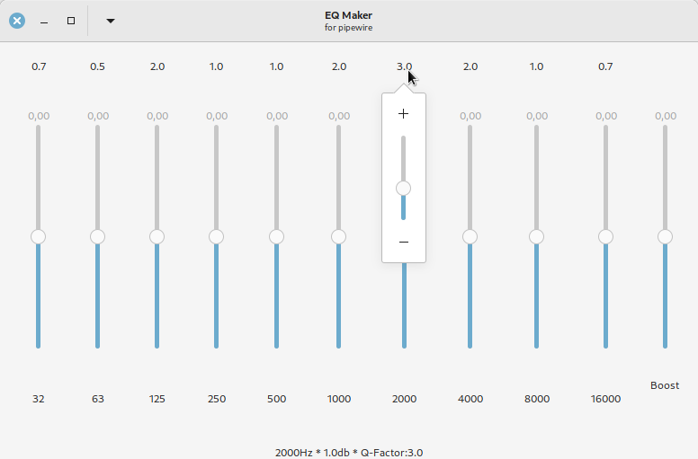

# EQ Maker for pipewire

### Requirements
- python3
- python3-gi
- pipewire

### Usage
```python3 pw_eq_maker.py```

- adjust the values
- choose ***Save*** from the menu at the headerbar

>a file named sink-eq10.conf will be created in the script folder

>copy the file 'sink-eq10.conf' to the folder ~/.config/pipewire/pipewire.conf.d

- restart pipewire or restart computer
- open your sound settings app
- choose ***Pipewire Equalizer*** as output


